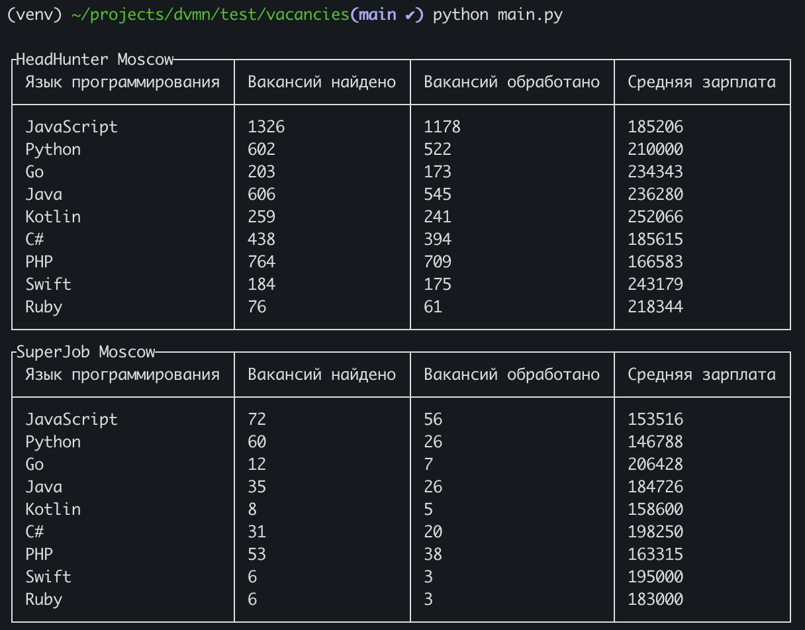

# Get HeadHunter and SuperJob vacancies statistics

This project is a simple command line tool for getting  
software developer vacancies statistics from HeadHunter and SuperJob.



## Features
- Get HeadHunter vacancies stats via [HH API](https://github.com/hhru/api/)
- Get SuperJob vacancies stats via [SuperJob API](https://api.superjob.ru/)
- Specify area, professional role and some other search parameters if needed
- Print nicely formatted tables with vacancies stats

## Installation notes
1. Clone project
```bash
git clone https://github.com/gennadis/vacancies.git
cd vacancies
```

2. Create virtual environment
```bash
python3 -m venv env
source env/bin/activate
```

3. Install requirements
```bash
pip install -r requirements.txt
```

4. Create `.env` file and place your SuperJob Token in it
```python
SUPERJOB_TOKEN=place_your_token_here
```

5. Run
```bash
python main.py
```
